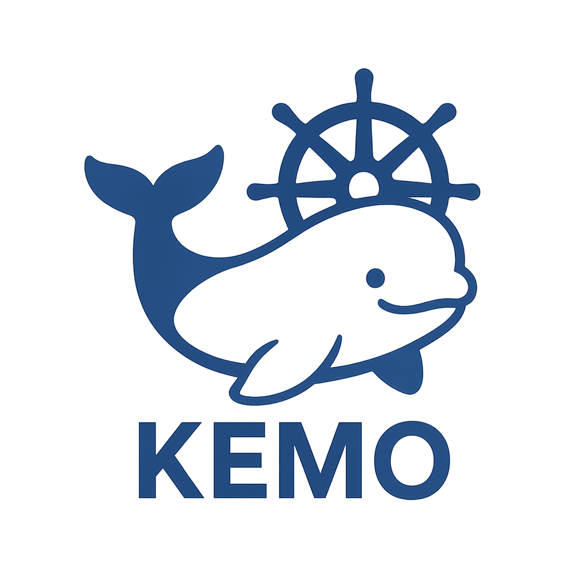

# 🧪🐳 Kemo



Kemo is a Kubernetes demo runner with interactive terminal UI, logging, variant switching, and structured metadata. Perfect for building, sharing, and running Kubernetes scenarios for learning or demonstration.

Kemo is pronounced like "Chem-Oh", or like "Ken-Oh" with an "m" instead of "n" as a shortened version of Kubernetes Demo.

## 🔧 Features

- **Interactive TUI**: Full tmux-based terminal interface with hotkeys
- **Demo Browser**: Interactive demo selector using `gum` with fuzzy search
- **Multi-panel Interface**: Split-screen views for logs, resource monitoring, and execution
- **Step-by-Step Execution**: Controlled demo progression with manual step execution
- **Intelligent Logging**: Timestamped logs with clean formatting for files
- **Tag Filtering**: Organize and find demos by tags
- **Variant System**: Compare working (`good/`) vs broken (`bad/`) scenarios
- **Progress Indicators**: Visual feedback with spinners and progress bars
- **Health Checks**: Built-in environment validation
- **Structured Metadata**: Rich demo descriptions with `metadata.yaml`

## 🚀 Quick Start

Run this one-liner to install `just`, clone the repo, and get started browsing demos:

```bash
if ! command -v just &> /dev/null; then echo "Installing Just..."; if command -v brew &> /dev/null; then brew install just; elif command -v apt &> /dev/null; then sudo apt update && sudo apt install -y just; elif command -v dnf &> /dev/null; then sudo dnf install -y just; else cargo install just; fi; fi && git clone https://github.com/toozej/kemo.git && cd kemo && just install-deps && just health-check && just browse-demos
```

## 🎮 Usage and Available Commands

The `kemo` script is a wrapper around `just`. You can see all available commands by running `just --list` or `kemo --list`.

```bash
# Demo Operations
./kemo select-demo               # Interactive demo selector
./kemo browse-demos              # Demo browser interface
./kemo run-demo <demo> <variant> # Run demo with step-by-step control
./kemo list-tags                 # Show all available tags

# Environment Management  
./kemo kubernetes-setup          # Setup K8s (OrbStack/Minikube)
./kemo kubernetes-cleanup        # Clean up K8s resources
./kemo kubectl-cleanup           # Clean kubectl contexts
./kemo health-check              # Validate environment

# Utilities
./kemo install-deps              # Install all prerequisites
```

## 📋 Prerequisites

Install dependencies automatically:
```bash
./kemo install-deps
```

Or install manually:
- `kubectl` - Kubernetes CLI
- `gum` - Enhanced shell interactions  
- `yq` - YAML processor
- `tmux` - Terminal multiplexer for TUI
- `just` - Command runner

## 🎮 TUI Interface

When running demos, Kemo launches a rich terminal interface with multiple panels and hotkeys.

### Panel Layout

```
┌─────────────────────────────────┬─────────────────────┐
│                                 │                     │
│         Main Execution          │      Demo Logs      │
│            Panel                │      (tail -f)      │
│                                 │                     │
│                                 ┼─────────────────────┤
│                                 │ Kubernetes Resources│
│                                 │ (get, status)       │
└─────────────────────────────────┴─────────────────────┘
```

### 🔑 Hotkeys Reference

All hotkeys use the prefix `Ctrl-k` followed by a command key:

#### Demo Control
- **`Ctrl-k r`** - Restart demo (deletes resources and reapplies)
- **`Ctrl-k n`** - Execute next demo step
- **`Ctrl-k q`** - Quit demo (with confirmation)
- **`Ctrl-k ?`** - Show hotkeys help

#### Kubernetes Operations  
- **`Ctrl-k s`** - Show Kubernetes status (pods, services, deployments)
- **`Ctrl-k d`** - Open Kubernetes dashboard in browser
- **`Ctrl-k o`** - Tail application logs in current pane
- **`Ctrl-k i`** - Describe selected Kubernetes resource (interactive)

#### Panel Management
- **`Ctrl-k v`** - Split current pane vertically
- **`Ctrl-k x`** - Split current pane horizontally
- **`Ctrl-k c`** - Close current pane
- **`Ctrl-k w`** - Open pod watch in new pane (`kubectl get pods --watch`)
- **`Ctrl-k e`** - Open events watch in new pane (`kubectl get events --watch`)

### Navigation
- Use standard tmux navigation: `Ctrl-k` + arrow keys to move between panes
- `Ctrl-k` + number keys (1-9) to jump to specific pane
- `Ctrl-k` + `z` to zoom/unzoom current pane

### Status Bar
The bottom status bar shows:
- Current demo and variant
- Hotkey reminder (`Ctrl-k ? for help`)
- Session information

## 🎯 Demo Selection Features

### Interactive Selector
```bash
./kemo select-demo
```

Features:
- **Tag Filtering**: Filter demos by tags or show all
- **Rich Previews**: See demo descriptions, tags, and metadata
- **Fuzzy Search**: Type to filter demo names and descriptions  
- **Metadata Viewer**: Built-in pager for demo details
- **Pre-flight Checks**: Validates environment before running
- **Advanced Options**: Verbose logging, dry run, custom namespaces

### Demo Browser
```bash
./kemo browse-demos
```

Alternative interface for exploring available demos with instant search and filtering.

### Available Options

#### Advanced Runtime Options
- **Verbose Logging**: Enhanced output for debugging
- **Dry Run Mode**: Shows commands without executing
- **Skip Cleanup**: Leaves resources running after demo
- **Custom Namespace**: Use specific namespace instead of demo name

#### Environment Variables
Set these before running demos:
- `KEMO_VERBOSE=true` - Enable verbose output
- `KEMO_DRY_RUN=true` - Show commands only
- `KEMO_SKIP_CLEANUP=true` - Skip resource cleanup
- `KEMO_NAMESPACE=custom` - Use custom namespace

## 📂 Demo Structure

```
demos/
├── hello-world/
│   ├── good/                    # Working variant
│   │   ├── deployment.yaml      # Kubernetes manifests
│   │   ├── service.yaml
│   │   ├── kustomization.yaml   # Kustomize config
│   │   ├── metadata.yaml        # Demo metadata and docs
│   │   ├── run.sh               # Demo execution script
│   │   └── .logs/              # Auto-generated logs (gitignored)
│   └── bad/                     # Broken variant
│       ├── deployment.yaml      # Same structure
│       ├── service.yaml         # (with intentional issues)
│       ├── kustomization.yaml
│       ├── metadata.yaml
│       └── run.sh
└── another-demo/
    ├── good/
    └── bad/
```

### Metadata Format

Each demo variant includes a `metadata.yaml` file:

```yaml
name: "Demo Display Name"
description: |
  Multi-line description of what this demo
  demonstrates and its learning objectives.
source: "https://github.com/example/source"
tags: [networking, service, basic]
objectives:
  - "Learn about Kubernetes services"
  - "Understand port forwarding"
observations:
  - "Pods start successfully"
  - "Service routes traffic correctly"
```

## 📝 Logging

### Automatic Logging
- All demo steps are automatically logged to `.logs/<step>.log`
- Logs include timestamps and clean formatting (no terminal colors)
- Each demo variant maintains its own log directory
- Log files are automatically gitignored

### Log Locations
```
demos/
└── hello-world/
    └── good/
        └── .logs/
            ├── run.log          # Main execution log
            └── kubectl.log      # Kubernetes operations log
```

Session logs (when using `--log` flag):
```
logs/
└── hello-world/
    └── good/
        └── demo-20240125_143022.log  # Full session log
```

## 🏗️ Creating New Demos

1. **Create Demo Structure**:
   ```bash
   mkdir -p demos/my-demo/{good,bad}
   ```

2. **Add Kubernetes Manifests**:
   ```bash
   # Create deployment.yaml, service.yaml, etc.
   # Add kustomization.yaml to list resources
   ```

3. **Create Metadata**:
   ```yaml
   # demos/my-demo/good/metadata.yaml
   name: "My Demo - Working"
   description: "Description of what this demonstrates"
   tags: [tag1, tag2]
   objectives:
     - "Learning objective 1"
   observations:
     - "Expected behavior 1"
   ```

4. **Add Execution Script**:
   Create a `run.sh` that will be executed step-by-step. The stepper will automatically detect sections separated by blank lines or comments starting with `#`.

   Example structure:
   ```bash
   #!/usr/bin/env bash

   # Section 1 - Apply manifests
   kubectl apply -n "$KEMO_NS" --kustomize='.'
   gum style --foreground green "✅ Manifests applied"

   # Section 2 - Verify deployment
   kubectl rollout status deployment/my-app

   # Section 3 - Show resources (separated by blank line)
   kubectl get pods,svc -n "$KEMO_NS"

   # Final section
   echo "🎉 Press Ctrl-k n to proceed through steps"
   ```

5. **Test Your Demo**:
   ```bash
   ./kemo run-demo my-demo good
   # Use Ctrl-k n to execute each step
   ```

## 🛠️ Troubleshooting

### Common Issues

**"kubectl cluster not accessible"**
```bash
# Setup cluster
./kemo kubernetes-setup
# or manually
minikube start
```

**"Demo logs not appearing"**
- Check if `.logs/` directory exists in demo variant
- Ensure run.sh has proper permissions (`chmod +x`)
- Try verbose mode: `KEMO_VERBOSE=true ./kemo run-demo <demo> <variant>`

**"Hotkeys not working in TUI"**
- Ensure you're in the tmux session (check status bar)
- Try `Ctrl-k h` to verify hotkeys are loaded
- Check tmux version: `tmux -V` (requires 2.1+)

### Getting Help

1. **Check Environment**: `./kemo health-check`
2. **View Logs**: Check `.logs/` in demo directories
3. **Verbose Mode**: Add `KEMO_VERBOSE=true` before commands
4. **Reset Environment**: `./kemo kubernetes-cleanup && ./kemo kubernetes-setup`

## 🤝 Contributing

1. Fork the repository
2. Create a feature branch
3. Add your demo following the structure above
4. Test with `./kemo run-demo <your-demo> <variant>`
5. Submit a Pull Request

### Demo Guidelines
- Include both `good` and `bad` variants when possible
- Add comprehensive metadata with tags
- Keep demos focused on specific learning objectives
- Test in clean environments
- Document expected behaviors and outcomes
